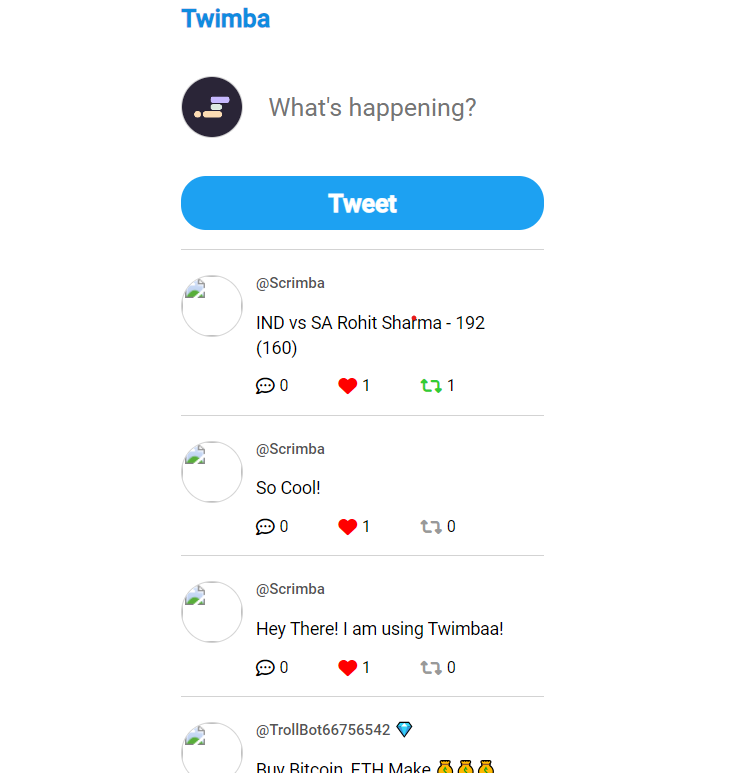

# Twitter UI Clone

## Project Description

The Twitter UI Clone is a web application built with JavaScript that emulates the look and feel of Twitter's user interface. This project is designed to provide a dynamic and interactive Twitter-like experience, where users can post tweets, explore timelines, and engage with the content in a familiar and user-friendly environment.

## Live Site URL

You can explore the live version of the project [here](https://eshans-tweet.netlify.app/).

## Screenshot

## Technologies Used

 
 
 

  

## License

This project is licensed under the MIT License. See the [LICENSE](LICENSE) file for details.

